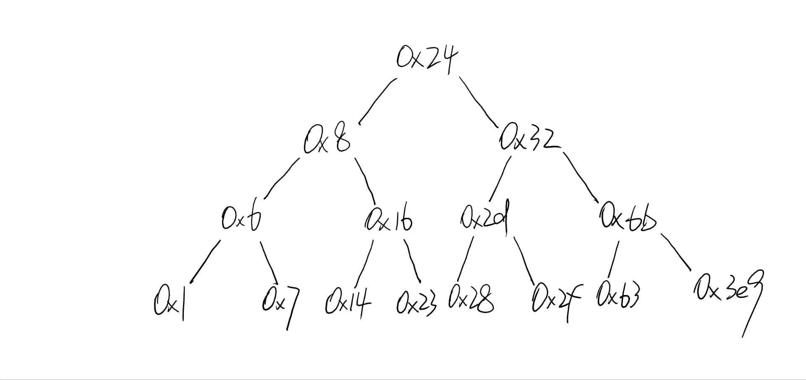

This is bomb 35.

It belongs to 202226010318 (esnl@hnu.deu.cn)


### gdb常用指令
```shell
disassemble # <函数名> 查看该函数的汇编代码
break *$函数名+$数字 # 在该汇编代码的位置设定断点
delete # 删除断点
```

## phase_1解法
```shell
break strings_not_equal # 设置断点1
break string_length # 设置断点2
next
i r查看寄存器的值
%eax装的输入的字符串的长度
%esi装的目标字符串
x/s $esi输出目标字符串
```

## phase_2解法
32位传参用栈，高地址到低地址参数6到参数1
参数6：`0x1c`
参数5：`0x18`
参数4：`0x14`
参数3：`0x10`
参数2：`0x0c`
参数1：`0x08`
好吧参数其实不重要，技巧是在关键节点设置断点
```bash
break *phase_2+25  # 第一次比较
8048b8d:	83 7c 24 18 00       	cmpl   $0x0,0ex18(%esp)     #比较第一个参数是否为0
break *phase_2+32  # 第二次比较
8048b94:	83 7c 24 1c 01       	cmpl   $0x1,0x1c(%esp)      #比较第二个参数是否为1
break *phase_2+58  # 第三、四、五、六次比较
8048bae:	39 03                	cmp    %eax,(%ebx)          #比较第是否为%eax
```
这时候穷举就行，每次到这个断点都看一眼`%eax`值是多少

## phase_3解法：
有三个重要节点
```s
 8048bf5:	83 7c 24 18 07       	cmpl   $0x7,0x18(%esp)					#
 8048bfa:	77 66                	ja     8048c62 <phase_3+0x9e>			#参数1大于0x7爆炸
```
参数1小于等于7
```s
 8048c6c:	83 7c 24 18 05       	cmpl   $0x5,0x18(%esp)					#参数1需要小于等于5
 8048c71:	7f 06                	jg     8048c79 <phase_3+0xb5>			#参数1大于0x5爆炸
```
参数1小于等于5
```s
 8048c73:	3b 44 24 1c          	cmp    0x1c(%esp),%eax
 8048c77:	74 05                	je     8048c7e <phase_3+0xba>			#%eax等于参数2不爆炸
```
参数2等于`%eax`
在 `*phase_3+175`设置断点看eax的值即可，也就是`break  *phase_3+175`

## phase4解法：
首先摸清楚参数是怎么放的
参数1：`0x1c(%esp)`
参数2：`0x18(%esp)`
然后根据下面的汇编代码推断
```s
 8048d0f:	83 f8 01             	cmp    $0x1,%eax						#
 8048d12:	7e 05                	jle    8048d19 <phase_4+0x3a>			#参数2小于等于1爆炸
 8048d14:	83 f8 04             	cmp    $0x4,%eax						#
 8048d17:	7e 05                	jle    8048d1e <phase_4+0x3f>			#参数2小于等于4不炸		1<参数2<=4
```
1<参数2<=4
还有是参数1的设置
```s
 8048d32:	3b 44 24 1c          	cmp    0x1c(%esp),%eax					#参数1和%eax相等不爆炸，%eax是？
```
`func4`是递归，返回的值是`%eax`。最方便的方法就是在`*phase4+83`设置断点，看`%eax`的值。而递归函数func4本身也有规律可循，这是一个线性函数`y = 54 * 参数2`

## phase_5解法：
参数布局：
参数1: `0x18(%esp)`
参数2: `0x1c(%esp)`
首先是经典的参数个数限制
```s
 8048d68:	83 f8 01             	cmp    $0x1,%eax						#%eax是参数个数
 8048d6b:	7f 05                	jg     8048d72 <phase_5+0x31>			#参数个数大于1不爆炸
```
参数个数需要大于1，然后是参数1限制：
```s
 8048d7d:	83 f8 0f             	cmp    $0xf,%eax						#%eax是参数1取16模
 8048d80:	74 2a                	je     8048dac <phase_5+0x6b>			#%eax的二进制的后四位是1则爆炸，即参数1取16模余数为15
```
参数1取16模余数不能为15
接下来是一个循环，每次循环edx+1，需要循环15次
循环的关键围绕着这个数组
```s
0x804a240 <array.2954>:         10      2       14      7
0x804a250 <array.2954+16>:      8       12      15      11
0x804a260 <array.2954+32>:      0       4       1       13
0x804a270 <array.2954+48>:      3       9       6       5
```
每次循环取`%eax`为`array[%eax]`，`%eax`与`15`比较，相等就退出循环
也就是说要设置一个`%eax`值能让它循环`1`5次
经过推理发现`%eax`应取`5`
也就是参数1取16模余数为5
参数2的话设置断点`break *phase_5+101`看`%ecx`的值吧

## phase_6解法：
简单来说就是对链表从小到大排序
链表布局：
```
<node1>: 283 1 下一个节点的地址
<node2>: 443 2 下一个节点的地址
<node3>: 828 3 下一个节点的地址
<node4>: 535 4 下一个节点的地址
<node5>: 103 5 下一个节点的地址
<node6>: 674 6 空地址
```
链表结构：
```c
struct node {
    int value;
    int id;
    struct node *next;
} //占12字节
```
输入的参数是几就代表第几个节点
当然参数也有约束
1、参数小于等于6（这是当然，只有6个node）
```s
 8048dda:	83 f8 05             	cmp    $0x5,%eax						#%eax=参数1 - 1，
 8048ddd:	76 05                	jbe    8048de4 <phase_6+0x2f>			#%eax小于等于5不炸，参数1<=6。循环着发现所有参数都
```
2、参数不能重复：
```s
 8048e0b:	8b 44 24 0c          	mov    0xc(%esp),%eax					#%eax=参数1
 8048e0f:	8b 00                	mov    (%eax),%eax						#%eax=*(%eax)
 8048e11:	39 44 24 08          	cmp    %eax,0x8(%esp)					#*(%eax)和参数2比较
 8048e15:	74 05                	je     8048e1c <phase_6+0x67>			#相等爆炸
```

## secret_phase解法：
首先是找到隐藏的入口
发现在`phase_defused`函数里有一个`secret_phase`函数
顺着找到`0x804a3f2`中的字符串，这就是打开隐藏门的钥匙
怎么打开呢？
发现`phase_4`输入的参数存在`0x804c4d0`中
如果在`phase_4`原本的输入后加上钥匙字符串，就能打开隐藏门
在`secret_phase`中有`fun7`
fun7是依托一个二叉树结构的递归函数：
```c
int fun7(Node *root, int val){
    if(root == NULL)
        return -1;
    if(root->value == val)
         return 0;       
    else if(root->value > val)
    	return 2*fun7(root->left,val);
    else if(root->value < val)
        return 2*fun7(root->right,val)+1;
}
```
二叉树结构：

只要让返回值为`3`就能解决secret_phase
这个值就是`0x6b 107`